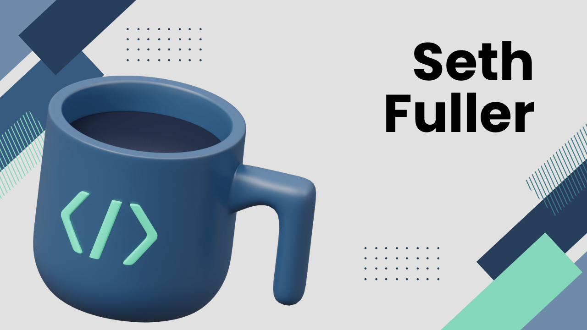

  

  <h1>Hi there 👋, my name is Seth!</h1>
  <h4>What I do: 🔬+ 💻 = 😮</h4>
  

    
    
  

   

I’m Seth Fuller! (@sfullerbeckman), and I work at Beckman Coulter Life Sciences. I’m interested in all things web tech. I especially like investigating new web frameworks such as Svelte and SvelteKit. Although not web tech, I’m also learning WPF and Go!

**Skills:** C# • JS/TS • WPF • Flutter • Golang

### Current feature requests
[Submit a suggested change to a PR from the Github CLI](https://github.com/cli/cli/discussions/5904)
  
[Merge freeze on branch](https://github.com/orgs/community/discussions/16796)

  
  

